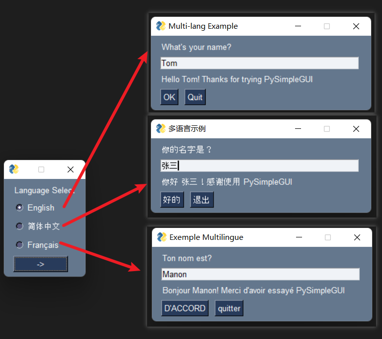

# PySimpleGUI Language Selection Demo

This example demostrates a simple technique for internationalization (i18n) when using PySimpleGUI. When the program starts, the user is prompted to select a language. The program then loads in the appropriate language file, or fallback to a default language if the user did not make a choice. This example doesn't allows changing language on the fly.

- `language_select_demo.py`: Main program
- `language_dicts.py`: Dictionary of strings in different languages

